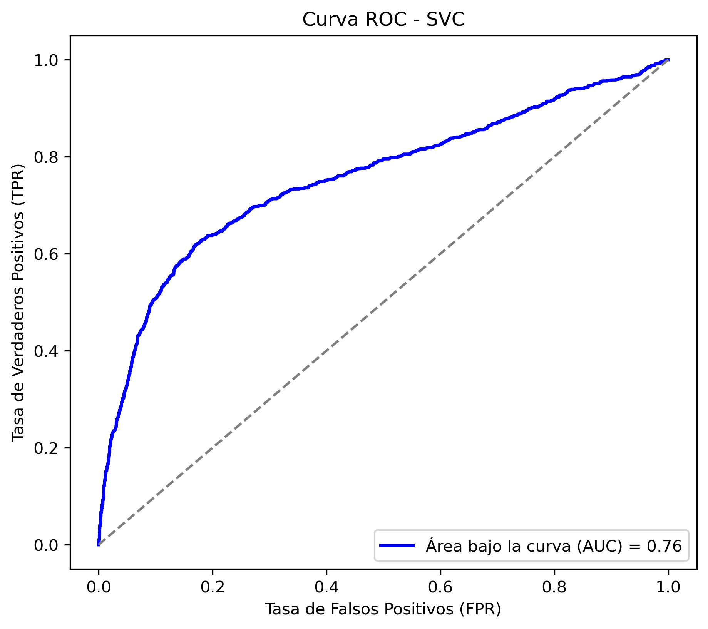

# 📊 Proyecto_IA - Machine Learning

## 📌 Descripción del Proyecto
Este proyecto aplica técnicas de **Machine Learning** para predecir si un cliente aceptará un **depósito a plazo fijo** en una campaña de marketing telefónico de un banco portugués. Se ha utilizado el dataset **Bank Marketing** del UCI Machine Learning Repository.

El objetivo es desarrollar y comparar distintos modelos de clasificación, optimizando el rendimiento y la interpretabilidad de los resultados.

## 🔍 Dataset
- **Fuente**: [UCI Machine Learning Repository](https://archive.ics.uci.edu/ml/datasets/Bank+Marketing)
- **Número de registros**: **45,211**
- **Variables predictoras**: **17** (edad, ocupación, estado civil, etc.)
- **Variable objetivo**: `y` (0 = No acepta, 1 = Sí acepta)

## 🚀 Tecnologías Utilizadas
- **Python 3.12.7**
- **Scikit-Learn** (Modelos de clasificación)
- **Pandas** (Procesamiento de datos)
- **NumPy** (Cálculos numéricos)
- **Matplotlib & Seaborn** (Visualización)
- **Imbalanced-learn** (Balanceo de clases con SMOTE)

## 📊 Modelos Evaluados
Se probaron distintos modelos de Machine Learning:

| Modelo               | F1 Score (%) |
|----------------------|-------------|
| Logistic Regression | 62.52        |
| Decision Tree       | 61.46        |
| Random Forest       | 65.48        |
| KNN                 | 62.09        |
| SVC                 | **68.32**    |
| Naive Bayes         | 64.43        |
| Perceptron          | 52.02        |
| Ridge Classifier    | 61.94        |
| MLP                 | 64.54        |

🔹 **Mejor modelo:** **SVC (Support Vector Classifier)** con un **F1-score de 68.32%**

## 📉 Curva ROC del Mejor Modelo (SVC)
Se presenta la curva ROC para evaluar la capacidad de discriminación del modelo SVC:

## 🤝 Contribuciones
¡Las contribuciones son bienvenidas! Si deseas mejorar este proyecto, abre un **pull request** o crea un **issue**.

## 📄 Licencia
Este proyecto está bajo la licencia **MIT**. Puedes utilizarlo libremente con atribución.

---

💡 **Desarrollado por:** [AgusDev](https://github.com/AgustinZP)
